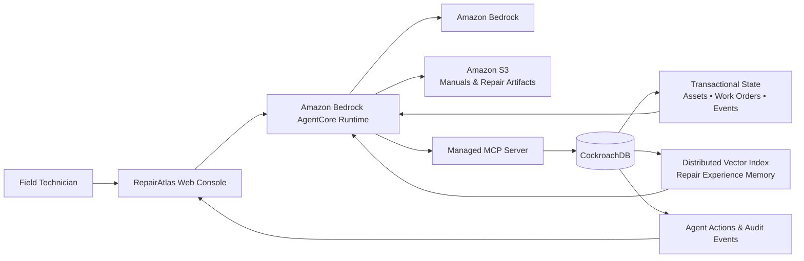

# RepairAtlas

> **Institutional memory for field operations.**
>
> Every repair teaches the next one.

RepairAtlas is an agentic field-service intelligence system designed to turn repair history into reusable operational memory. The agent retrieves previous failures, diagnoses, successful and failed interventions, reasons over the current asset state, performs controlled workflow actions, and converts completed repairs into new semantic memory.

Built for the **CockroachDB × AWS Hackathon — Build with Agentic Memory**.

## The core idea

Traditional field-service software records work orders. Traditional AI assistants answer questions. RepairAtlas closes the loop:

**Observe → Retrieve → Reason → Act → Verify → Learn**

A completed repair is not the end of the workflow. It becomes institutional knowledge that can improve the next repair.

## Why this matters

Field technicians often have to rediscover knowledge that already exists inside an organization:

- what failed before
- what was tried
- which intervention failed
- which intervention worked
- which parts were used
- what the technician observed
- what the final outcome was

RepairAtlas makes that experience durable, searchable, and actionable.

## Hackathon technology alignment

### CockroachDB

CockroachDB is the operational system of record and the agent's persistent memory layer.

We intentionally use two core CockroachDB capabilities:

1. **Distributed Vector Indexing** — semantic retrieval of previous repair experiences.
2. **CockroachDB Cloud Managed MCP Server** — governed agent interaction with CockroachDB through MCP.

The design keeps transactional asset state, repair history, agent state, audit records, and semantic memory together rather than introducing a separate vector database.

### AWS

The planned AWS execution path uses:

- **Amazon Bedrock** — foundation-model reasoning.
- **Amazon Bedrock AgentCore Runtime** — secure, serverless agent execution and session isolation.
- **Amazon S3** — service manuals, equipment documents, and repair artifacts.

AgentCore Runtime is framework-agnostic and supports MCP communication, session isolation, authentication, observability, and consumption-based execution. See the official AWS documentation in [`docs/technology.md`](docs/technology.md).

## Memory architecture

RepairAtlas models memory as more than conversation history:

| Memory layer | Purpose | Example |
|---|---|---|
| Operational | Current truth | asset status, work order state |
| Episodic | What happened | failure, diagnosis, action, outcome |
| Semantic | What is similar | vectorized repair experience |
| Learned | What worked | successful/failed intervention pattern |
| Audit | What the agent did | tool, action, approval, result |

The key design principle is **experience memory**: a repair event becomes future decision context.

## Golden demo

The primary demonstration is intentionally simple and reproducible:

1. `PRESS-204` reports overheating during extended operation.
2. The agent loads the current asset state.
3. CockroachDB vector memory retrieves semantically similar historical repairs.
4. The agent compares successful and unsuccessful interventions.
5. It recommends inspecting airflow before replacing the motor.
6. A controlled action creates a diagnostic work order.
7. A technician records the successful repair.
8. RepairAtlas converts that outcome into new semantic memory.
9. A later incident is phrased differently.
10. The agent retrieves the earlier experience and uses it again.

The judge should be able to see the complete memory lifecycle in one continuous workflow.

## Architecture



A larger architecture specification is maintained in [`docs/architecture.md`](docs/architecture.md).

## Repository map

```text
repair-atlas/
├── README.md
├── ROADMAP.md
├── BLUEPRINT.md
├── SECURITY.md
├── LICENSE
├── .gitignore
├── .env.example
├── docs/
│   ├── architecture.md
│   ├── article.md
│   ├── demo-script.md
│   ├── judging-strategy.md
│   └── technology.md
├── database/
│   ├── README.md
│   └── schema.md
├── agent/
│   └── README.md
├── app/
│   └── README.md
├── infrastructure/
│   └── README.md
└── tests/
    └── README.md
```

The repository is intentionally being established as a **new hackathon project**. Implementation will be added only after the architecture and compliance gates are validated.

## Security principles

RepairAtlas will follow least privilege by design:

- no secrets committed to Git
- scoped CockroachDB credentials
- constrained agent tools
- approval gates for consequential writes
- immutable audit records
- input validation
- no unrestricted SQL from the model
- no credentials in application logs
- explicit failure handling

See [`SECURITY.md`](SECURITY.md).

## Development status

**Phase: Architecture and foundation.**

The current repository contains the product blueprint, architecture, judging strategy, demo plan, security model, and implementation roadmap. Functional code will be added incrementally after the architecture sanity check.

## Competition

**CockroachDB × AWS Hackathon — Build with Agentic Memory**

The project is being developed as a new submission during the hackathon period. All reused libraries, frameworks, templates, or external components will be documented appropriately.

## License

MIT. See [`LICENSE`](LICENSE).
