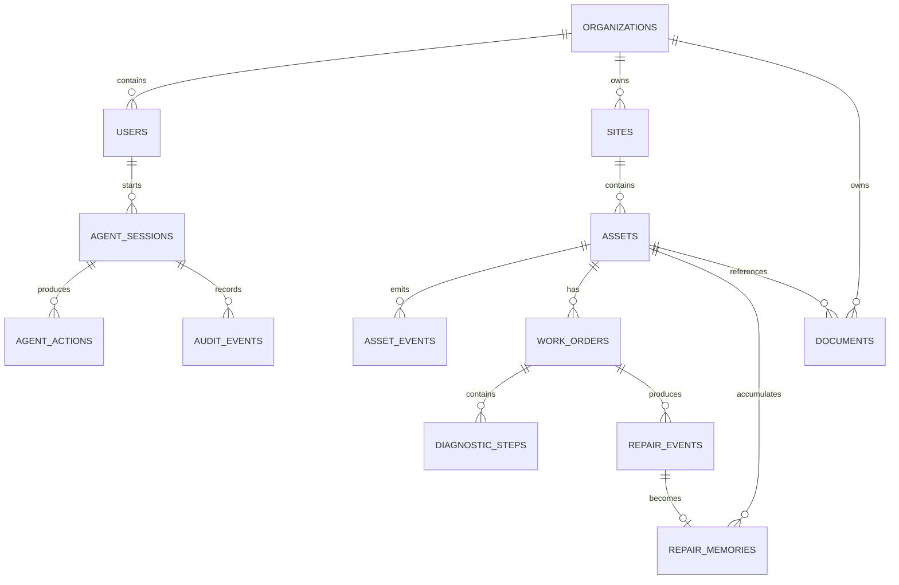

# RepairAtlas Data Model

This is the implementation blueprint. SQL migrations will be created after validating the final CockroachDB version and vector-index syntax.

## organizations

```text
id
name
created_at
```

## users

```text
id
organization_id
role
name
created_at
```

## sites

```text
id
organization_id
name
location
created_at
```

## assets

```text
id
organization_id
site_id
asset_code
model
serial_number
status
installed_at
metadata
created_at
updated_at
```

## asset_events

```text
id
asset_id
event_type
severity
description
metadata
created_at
```

## work_orders

```text
id
asset_id
assigned_to
status
problem_statement
diagnosis
resolution
created_at
updated_at
completed_at
```

## diagnostic_steps

```text
id
work_order_id
step_order
observation
action
result
created_at
```

## repair_events

```text
id
work_order_id
asset_id
technician_id
symptoms
diagnosis
action_taken
parts_used
outcome
success
confidence
created_at
```

## repair_memories

```text
id
organization_id
asset_id
repair_event_id
memory_type
summary
failure_pattern
symptoms
diagnosis
action_taken
outcome
success
confidence
embedding
created_at
updated_at
```

The embedding is used for semantic retrieval through CockroachDB vector indexing.

## documents

```text
id
organization_id
asset_id
object_key
title
document_type
metadata
created_at
```

## agent_sessions

```text
id
user_id
organization_id
asset_id
status
started_at
ended_at
```

## agent_actions

```text
id
session_id
work_order_id
action_type
tool_name
approval_status
request_summary
result_summary
created_at
completed_at
```

## audit_events

```text
id
organization_id
session_id
actor_type
action
resource_type
resource_id
result
metadata
created_at
```

## Relationship overview



## Implementation note

The final schema should favor clear constraints, explicit foreign keys, indexes that match real query patterns, and transactional correctness over premature abstraction.
