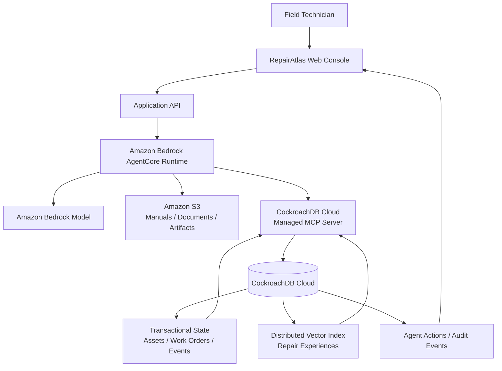
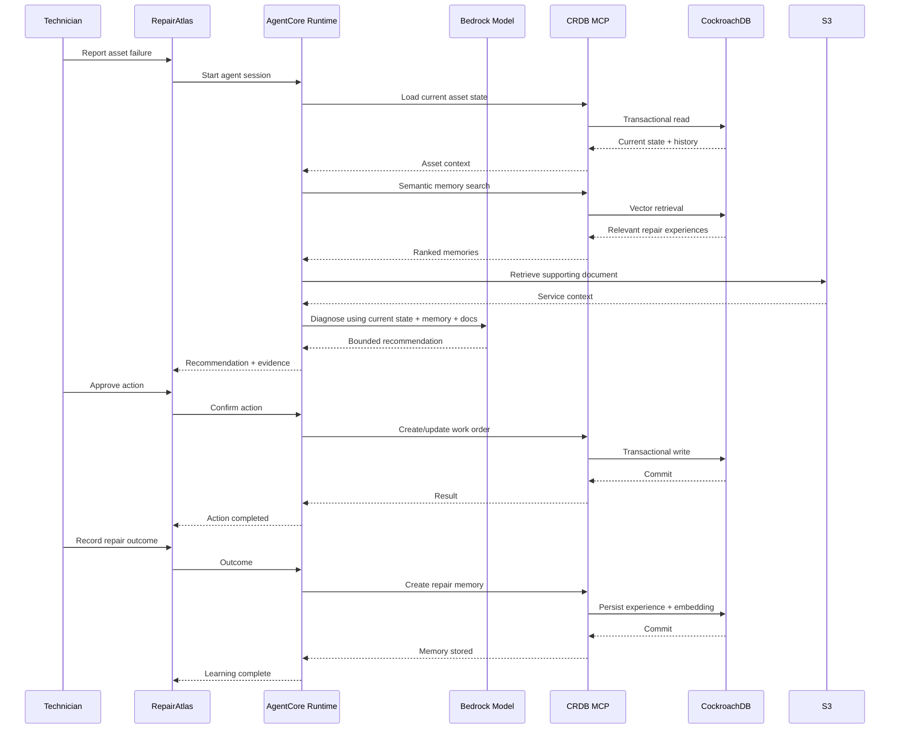
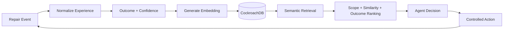
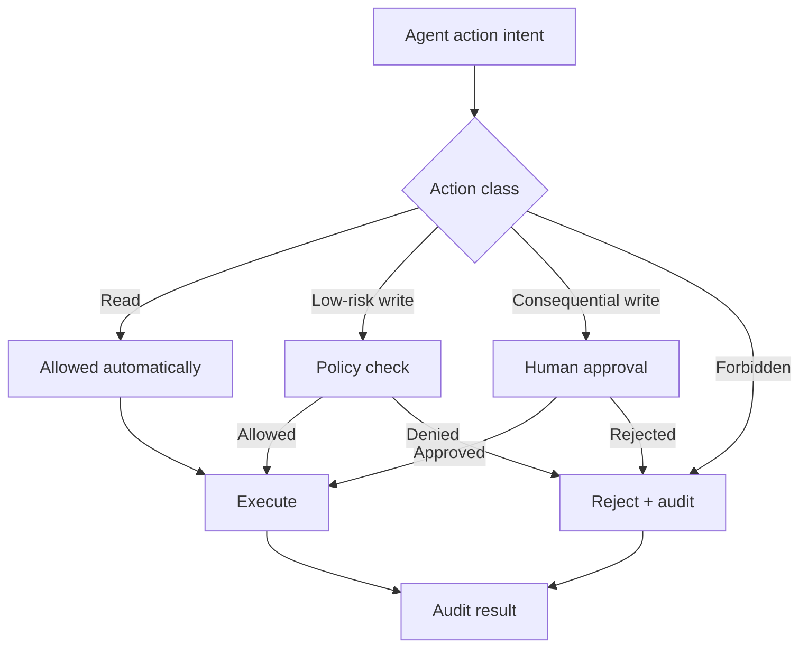

# RepairAtlas Architecture

## System objective

RepairAtlas is a stateful agentic application where CockroachDB is both the operational system of record and the long-term semantic memory layer.

The architecture is optimized for four properties:

1. **Memory continuity** — past repair experiences influence future decisions.
2. **Transactional correctness** — current asset/work-order state remains authoritative.
3. **Governed agency** — the model can recommend and execute only bounded actions.
4. **Operational observability** — agent actions and outcomes are auditable.

## High-level architecture

## Agent lifecycle

## Memory lifecycle

This creates a closed learning loop without requiring a separate vector database.

## Data boundaries

### Browser

The browser is responsible for presentation and user confirmation. It must never receive database credentials or model-provider secrets.

### Application API

The API validates input, establishes user/session context, and forwards authorized requests to the agent runtime.

### AgentCore Runtime

The runtime hosts the orchestration code and enforces runtime-level isolation and authentication controls.

### Bedrock

The model produces decisions and tool-selection intent. It is not the system of record.

### MCP

MCP is the governed interface between the agent and CockroachDB. Database access must remain scoped.

### CockroachDB

CockroachDB is authoritative for operational state and persistent repair memory.

### S3

S3 contains documents and artifacts that are too large or document-oriented for the transactional memory model.

## Database design principles

### One source of operational truth

Asset state, work-order state, repair events, and audit state remain relational.

### Semantic memory beside structured state

Repair experiences carry embeddings while retaining relational identifiers such as `asset_id`, `repair_event_id`, outcome, and timestamps.

### Transactional outcome capture

When a repair is completed, the operational outcome and its durable memory record should be written with a clear consistency boundary. The exact transaction design will be validated during implementation.

### Scoped retrieval

Semantic search should prefer relevant asset/model/site context before similarity ranking where possible. This reduces irrelevant cross-asset matches.

## Action governance

## Failure strategy

### Database unavailable

Do not fabricate memory. Surface a clear unavailable state and pause memory-dependent diagnosis.

### Vector retrieval unavailable

Fallback to structured recent history only if the resulting behavior is explicitly labeled as degraded and remains safe.

### Model unavailable

Preserve access to existing work-order and asset information. Do not invent an AI recommendation.

### Tool failure

Return structured failure information, retry only when safe and bounded, and prevent duplicate writes through idempotency where appropriate.

### Low confidence

Escalate to the technician instead of manufacturing certainty.

## Scalability direction

The MVP is intentionally small. The architecture should remain compatible with:

- multiple organizations
- multiple sites
- regional data locality
- increasing repair-memory volume
- background embedding generation
- asynchronous document ingestion
- richer observability

Do not implement these until they improve the hackathon submission.

## Current architecture decision

Use **Amazon Bedrock AgentCore Runtime** rather than Bedrock Agents Classic for new development. AWS documents Bedrock Agents Classic as maintenance-mode technology that stopped accepting new customers on July 30, 2026, while AgentCore Runtime is the current serverless agent hosting path. See [`technology.md`](technology.md).
