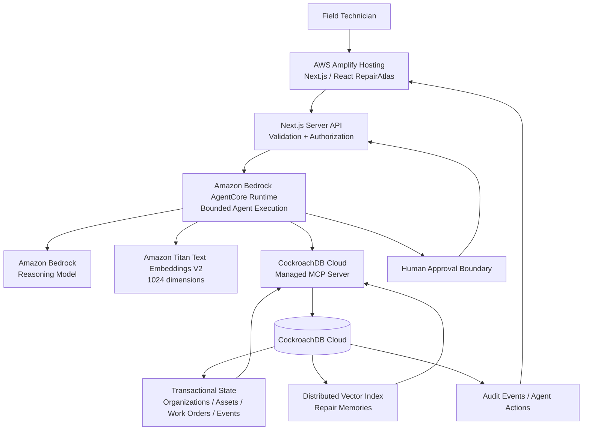
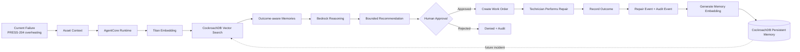
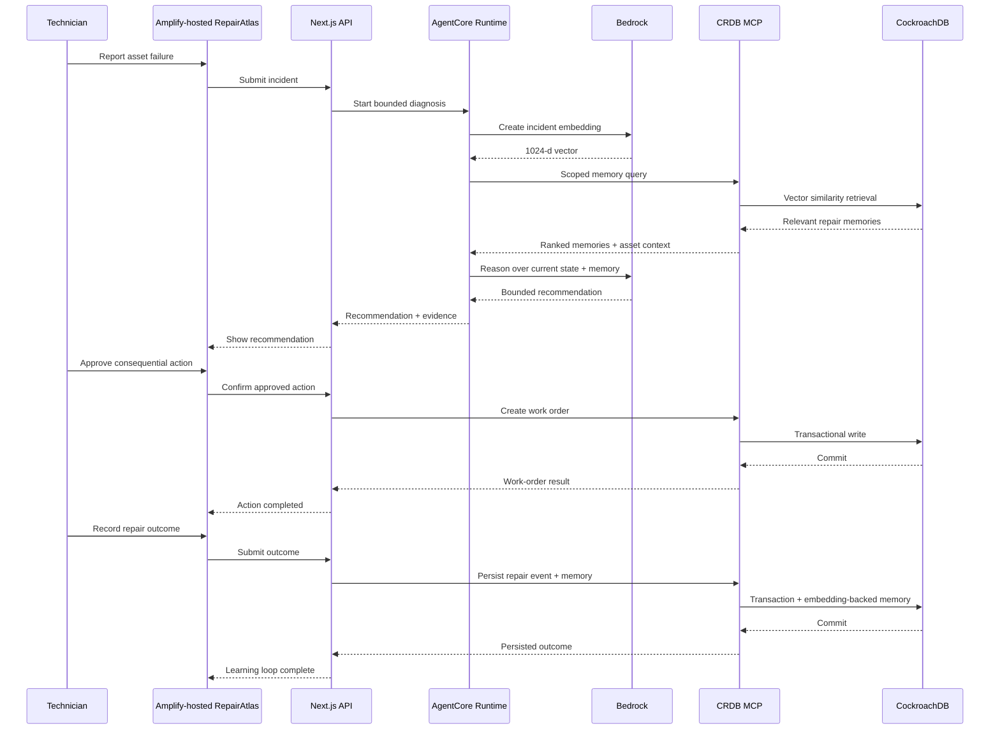
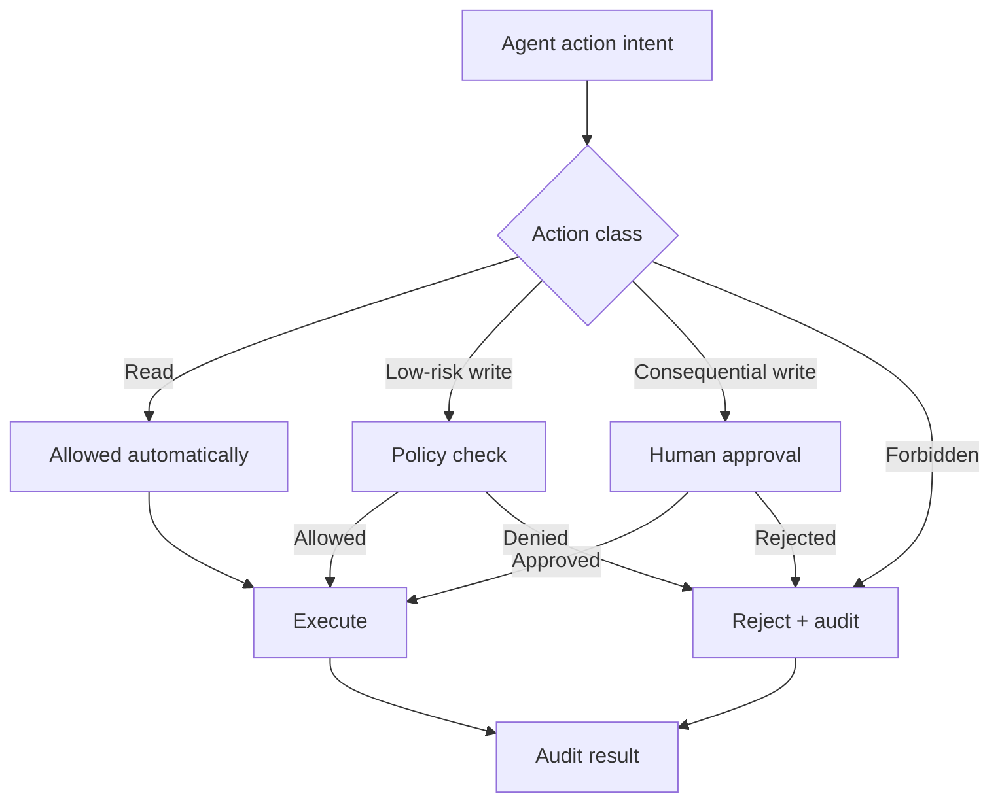

# RepairAtlas Architecture

## System objective

RepairAtlas is a stateful agentic field-operations application where **CockroachDB is the operational system of record and persistent semantic memory**, while AWS provides the production application hosting, model inference, and agent runtime.

The architecture is optimized for five properties:

1. **Memory continuity** — past repair experiences influence future decisions.
2. **Transactional correctness** — current asset/work-order state remains authoritative in CockroachDB.
3. **Meaningful AWS integration** — Amplify, Bedrock, and AgentCore each have a concrete production role.
4. **Governed agency** — the model can recommend, but consequential writes remain behind human approval.
5. **Operational observability** — agent actions, writes, failures, and outcomes are auditable.

## Current target architecture



### Responsibility split

| Component | Responsibility | Why it exists |
|---|---|---|
| **AWS Amplify Hosting** | Hosts the production Next.js application | Required AWS deployment and reliable public demo surface |
| **Next.js server API** | Validation, organization/asset authorization, approval workflow | Keeps secrets and authorization server-side |
| **Amazon Bedrock AgentCore Runtime** | Executes the bounded repair agent | Production agent runtime and observability |
| **Amazon Bedrock** | Reasoning over current incident + retrieved evidence | Model inference for diagnosis/recommendation |
| **Amazon Titan Text Embeddings V2** | Embeds incident/memory text into 1,024-dimensional vectors | Semantic memory representation |
| **CockroachDB Cloud** | Transactional source of truth + persistent memory | One durable system of record; no second vector database |
| **CockroachDB Distributed Vector Indexing** | Similarity retrieval over repair memories | Native semantic retrieval inside CockroachDB |
| **CockroachDB Managed MCP Server** | Governed agent/database interface | Explicit CockroachDB agent integration |
| **Human approval boundary** | Approves consequential actions | Prevents autonomous high-impact writes |

The MVP deliberately does **not** introduce EC2, RDS, DynamoDB, Lambda, or S3 merely to increase AWS service count. Each infrastructure component must have a clear product role and must not weaken CockroachDB's role as the persistent memory layer.

## Golden end-to-end path



The winning proof point is not a chat response. It is the **closed memory loop**:

**incident → retrieval → reasoning → approval → work order → repair outcome → durable memory → future retrieval**.

## Agent lifecycle



## Memory lifecycle

```mermaid
flowchart LR
    E[Repair Event] --> N[Normalize Experience]
    N --> X[Outcome + Evidence]
    X --> EMB[Amazon Titan Text Embeddings V2]
    EMB --> STORE[(CockroachDB VECTOR(1024))]
    STORE --> IDX[Distributed Vector Index]
    IDX --> RET[Scoped Semantic Retrieval]
    RET --> RANK[Similarity + Asset/Org Scope + Outcome]
    RANK --> AGENT[AgentCore + Bedrock]
    AGENT --> ACTION[Controlled Action]
    ACTION --> E
```

Similarity retrieval remains inside CockroachDB. The model does not invent historical records; it receives retrieved memory as evidence.

## Data boundaries

### Browser

The browser is responsible for presentation and explicit user confirmation. It never receives database credentials, AWS secret keys, or model-provider credentials.

### AWS Amplify / Next.js

Amplify hosts the public application. Server-side Next.js APIs perform input validation, organization/asset authorization, safe error handling, and the human approval workflow.

### AgentCore Runtime

AgentCore hosts the bounded orchestration path. It may read scoped context and request recommendations, but consequential application writes remain governed by the application's approval boundary.

### Bedrock

Bedrock provides model inference and embeddings. Model output is treated as untrusted input and is never the system of record.

### CockroachDB Managed MCP

MCP is the governed database interface exposed to the agent. Queries and writes must remain organization- and asset-scoped.

### CockroachDB

CockroachDB is authoritative for organizations, assets, work orders, repair events, audit events, and durable semantic repair memories.

## Database design principles

### One source of operational truth

Asset state, work-order state, repair events, and audit state remain relational in CockroachDB.

### Semantic memory beside structured state

Repair experiences retain relational identifiers such as `organization_id`, `asset_id`, `repair_event_id`, outcome, and timestamps alongside `VECTOR(1024)` embeddings.

### Transactional outcome capture

A completed repair produces an auditable repair event and a durable memory record. The implementation must preserve a clear consistency boundary and prevent duplicate writes where appropriate.

### Scoped retrieval

Semantic retrieval is scoped by organization and asset before similarity ranking. This reduces cross-tenant and cross-asset memory leakage.

## Action governance



## Failure strategy

### Database unavailable

Do not fabricate memory. Surface a clear unavailable state and pause memory-dependent diagnosis.

### Vector retrieval unavailable

Fallback to structured recent history only when explicitly labeled as degraded and still safe. Never silently substitute fabricated memory.

### Model unavailable

Preserve access to existing asset and work-order information. Do not invent an AI recommendation.

### Agent/tool failure

Return structured failure information, retry only when safe and bounded, and prevent duplicate consequential writes through idempotency where appropriate.

### Low confidence

Escalate to the technician instead of manufacturing certainty.

## AWS deployment path

The production path is intentionally small:

```text
GitHub main
    ↓
AWS Amplify Hosting
    ↓
Next.js 15 application + server APIs
    ↓
Amazon Bedrock AgentCore Runtime
    ↓
Amazon Bedrock reasoning + Titan embeddings
    ↓
CockroachDB Managed MCP
    ↓
CockroachDB Cloud
```

The AWS integration is meaningful at three distinct layers:

1. **Amplify** — public production hosting for the application.
2. **AgentCore Runtime** — execution and observability for the bounded agent.
3. **Bedrock** — reasoning and 1,024-dimensional embedding generation.

AWS usage should remain controlled during development. The project has AWS promotional credits, but infrastructure should be created for product necessity rather than to consume credits.

## Scalability direction

The MVP remains intentionally small while retaining compatibility with:

- multiple organizations and sites
- increasing repair-memory volume
- regional data locality
- background embedding generation
- asynchronous document ingestion if a future product requirement justifies it
- richer AgentCore/CloudWatch observability

Do not add infrastructure merely for architectural complexity or AWS service count.

## Current architecture decision

Use **Amazon Bedrock AgentCore Runtime** rather than Bedrock Agents Classic for new development. AgentCore is the current AWS agent-runtime path used by this project.

The architecture's source of truth is:

**CockroachDB = operational state + persistent memory**

**AWS Amplify = application hosting**

**AgentCore = agent execution**

**Bedrock = reasoning + embeddings**

**Human approval = consequential-action boundary**
